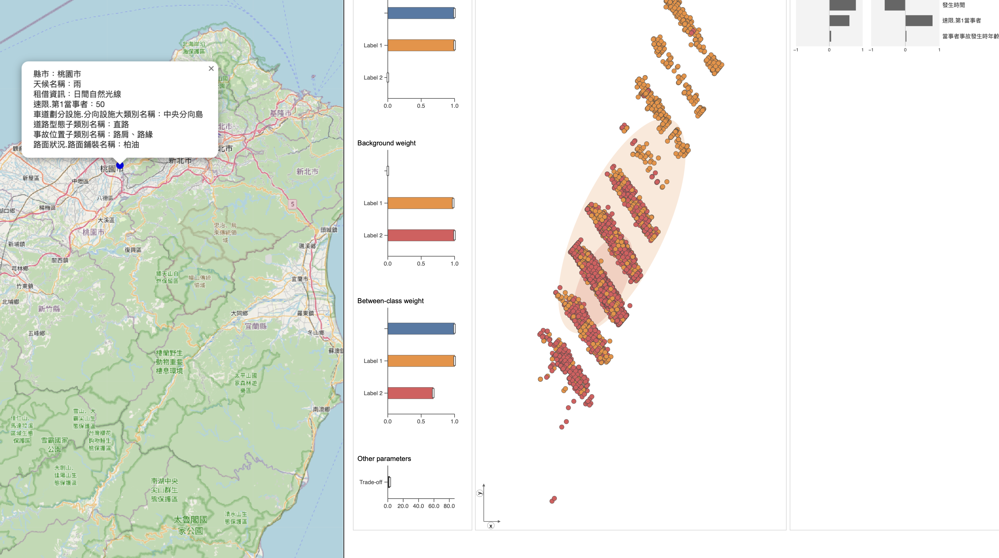

# 1131 資訊視覺化－學碩合開－臺灣各縣市交通事故記錄之視覺化呈現

- 111304019 統計三 林承佑
- 107703027 資科四 崔賢燮

## [實作Demo影片](https://drive.google.com/file/d/18bDBz2X5XvVVvFeRK9Ki32B22umGOVwv/view)

這份專案中，我們實作在IEEE上的[Interactive Dimensionality Reduction for Comparative Analysis](https://arxiv.org/abs/2106.15481)這篇paper的視覺化實作。

- 研究目標 － ULCA : unified linear comparative analysis
  - 一種降維方法，找到一組線性組合，組合間相關性為零Linear indepdently
  - 目標是在保持數據主要結構的同時消除冗餘信息。
  - 結合PCA、cPCA、LDA的主要概念並優化
  - 以致可以同時處理連續和類別的資料內容

透過空間和時間的視覺化分析，我們可以更直觀地了解事故的發生規律，並針對特定區域或時間段進行深入研究，從而提高交通安全。
- why:主要目標是發現交通事故數據中的潛在模式和趨勢。
- what:時間序列數據, 地理空間數據, 類別和數值型資料
- how:時間序列圖, 分層設色圖...等，以及ULCA的互動式降維操作，如篩選與過濾（Filter）, 縮放與平移（Zoom and Pan）等。

***

在這份專案中，我實作了：
- 整體網站的畫面編排架設，與互動式體驗，包含呈現邏輯以達到研究目標。
- 各項圖表的規劃和設計
- 資料集整理和前處理
- ULCA降維度視覺化圖片實現（python程式碼實作）

***

Setup
-----

### Requirements
* Python3 (latest)

### Setup

* Install manopt_dr, ulca, and ulca_ui

  * If using Python3.12 (otherwise, skip this step), need to edit and directly install pymanopt as follows because pymanopt installer only supports Python3.11 or older.

    - Download and move to the latest `pymanopt` repo: https://github.com/pymanopt/pymanopt.
    
    - Edit "pyproject.toml"

      - Line 2: `requires = ["pip>=22.3.1", "setuptools>=65.6.3"]`
      
      - Line 40: `"scipy>=1.0",`

    - Create "_version.py" in "src/pymanopt/" and write down a following line:

      - `__version__ = "2.2.0"`

    - Install `pymanopt`

      - `pip3 install .`

  * Download/Clone this repository

  * Move to the downloaded repository, then:

    `pip3 install .`

  

### Usage
- In the sample.py file, set the folder_path variable to the path of the folder containing the CSV files to be analyzed. Once set, all CSV files in the specified path will be automatically loaded and merged.

- In the selected_features variable, choose the features from the CSV files to be used in the analysis. These selected features will be utilized for the analysis.

- In the target_values variable, specify the target feature from the selected_features list.

* See sample.py
  - To run sample.py from the command line, use -i option:

    `python3 -i sample.py` or `python -i sample.py`

  - If you cannot see the visualized results, try a hard refresh (e.g., when Mac + Chrome, Ctrl + Shift + R) at the jupyter notebook you are using.

### 備註

- 若只開啟第一目錄下的 index.html （即使用助教課所教的node.js 的server.js，則會無法使用降維的功能）。
- 只有以`python3 -i sample.py`的方式開啟本網站時，主畫面中的降維視覺化才會具有連結，並可點擊前往使用降維功能。
